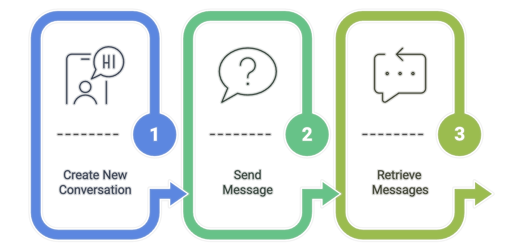

# MCP Server for Dust Agent Integration

A custom MCP (Multi-Cloud Provider) server that connects to the Dust.tt agent platform via HTTP calls. This server exposes the capabilities of Dust AI agents through the MCP interface.

## Table of Contents
- [MCP Server for Dust Agent Integration](#mcp-server-for-dust-agent-integration)
  - [Table of Contents](#table-of-contents)
  - [Features](#features)
  - [Project Structure](#project-structure)
  - [Prerequisites](#prerequisites)
  - [Installation](#installation)
  - [Configuration](#configuration)
    - [Dust Agent Setup](#dust-agent-setup)
    - [MCP Server Settings](#mcp-server-settings)
  - [Running the Server](#running-the-server)
  - [Claude Desktop Integration](#claude-desktop-integration)
    - [1. Installation](#1-installation)
    - [2. Initial Setup](#2-initial-setup)
    - [3. Integration with MCP Server](#3-integration-with-mcp-server)
    - [4. Applying Configuration Changes](#4-applying-configuration-changes)
    - [5. Testing in Claude Desktop](#5-testing-in-claude-desktop)
  - [Troubleshooting](#troubleshooting)
  - [Dust.tt API Workflow](#dusttt-api-workflow)
    - [1. Create a New Conversation](#1-create-a-new-conversation)
    - [2. Send a Message to the Conversation](#2-send-a-message-to-the-conversation)
    - [3. Retrieve Messages from the Conversation](#3-retrieve-messages-from-the-conversation)
    - [Important Notes About the API](#important-notes-about-the-api)
    - [Error Handling](#error-handling)
  - [Contributing](#contributing)

## Features

- Connect to Dust.tt AI agents via API
- Systems Thinking agent integration with cognitive neuroscience and problem-solving capabilities
- RAG (Retrieval Augmented Generation) support
- Web navigation capability
- Simplified MCP tool interface
- Modular code structure for better maintainability
- Externalized configuration and API client classes

## Project Structure

The project follows a modular structure for improved maintainability:

- `server.py`: Main server implementation that registers tools and handles MCP functionality
- `config.py`: Contains the `DustAgentConfig` class for managing configuration settings
- `api_client.py`: Contains the `DustAPIClient` class for handling API interactions with Dust.tt
- `.env`: Environment variables file (not committed to version control)
- `.env.example`: Template for environment variables

## Prerequisites

- Python 3.10 or higher
- `pip` package manager
- A Dust.tt account with API access
- An existing Dust agent configuration

## Installation

1. **Clone this repository:**

   ```bash
   git clone https://github.com/Ma3u/mcp-server-dust.git
   cd mcp-server-dust
   ```

2. **Create and activate a virtual environment:**

   ```bash
   python3 -m venv .venv
   
   # On macOS/Linux
   source .venv/bin/activate
   
   # On Windows
   .venv\Scripts\activate
   ```

3. **Install required dependencies:**

   ```bash
   pip install --upgrade pip
   pip install mcp requests python-dotenv
   ```

## Configuration

### Dust Agent Setup

Create a `.env` file in the root directory with your configuration (you can copy from `.env.example` and modify):

```
# MCP Server Configuration
MCP_NAME=Dust MCP Server
MCP_HOST=127.0.0.1
MCP_PORT=5001
MCP_TIMEOUT=30

# Dust Agent Configuration
DUST_AGENT_ID=your_agent_id
DUST_DOMAIN=https://dust.tt
DUST_WORKSPACE_ID=your_workspace_id
DUST_WORKSPACE_NAME=your_workspace_name
DUST_API_KEY=your_api_key
DUST_AGENT_NAME=your_agent_name
DUST_TIMEZONE=Europe/Berlin
DUST_USERNAME=your_username
DUST_FULLNAME=Your Full Name
```

> **Security Note:** Make sure to add `.env` to your `.gitignore` file to prevent committing sensitive information.

### MCP Server Settings

The server configuration parameters are now managed by the `DustAgentConfig` class in `config.py`. Parameters are loaded from environment variables with the following defaults:

```python
# MCP Server Configuration
MCP_NAME = "Dust MCP Server"  # Name of your MCP server
MCP_HOST = "127.0.0.1"        # Host to run the server on
MCP_PORT = 5001               # Port to run the server on
MCP_TIMEOUT = 30              # Request timeout in seconds

# Dust Agent Configuration
DUST_AGENT_ID = "8x9nuWdMnR"  # Your Dust agent ID
DUST_DOMAIN = "https://dust.tt" # Dust API domain
# ... and other Dust-specific settings
```

## Running the Server

To start the MCP server:

```bash
python server.py
```

You should see output similar to:

```
Starting MCP server 'Dust MCP Server' on 127.0.0.1:5001
Connected to Dust agent 'SystemsThinking' (ID: 8x9nuXXXX)
```

The server will run until interrupted with Ctrl+C.

## Claude Desktop Integration
        
To configure Claude Desktop for use with this MCP server:
        
### 1. Installation

- Download Claude Desktop from the [official Anthropic website](https://www.anthropic.com/claude/download)
- Install the application following the on-screen instructions for your OS
        
### 2. Initial Setup

- Launch the app after installation
- Sign in with your Anthropic account (free account is sufficient)
        
### 3. Integration with MCP Server

- Launch Claude Desktop and go to Settings
- Select the "Developer" tab on the left sidebar
- Click the "Edit Config" button at the bottom of the screen
- Add your Dust MCP server to the configuration by including it in the `mcpServers` array:

```json
{
    "mcpServers": {
        "dust": {
            "command": "/Users/ma3u/projects/mcp-server-dust/.venv/bin/python",
            "args": [
                "/Users/ma3u/projects/mcp-server-dust/server.py"
            ],
            "host": "127.0.0.1",
            "port": 5001,
            "timeout": 10000
        }
    }
}
```

> **Note:** If there are existing entries in the `mcpServers` array, add your configuration as a new item.

### 4. Applying Configuration Changes

- After making changes to your MCP server configuration:
  - For Claude Desktop, quit the application completely 
  - Relaunch Claude Desktop for the new configuration to take effect
- Verify the connection by checking if your server appears in the list in the Developer settings

### 5. Testing in Claude Desktop

Type the following in Claude Desktop to test your integration:

```
Use Systemsthinking Agent to explain MCP Protocol.
```

## Troubleshooting

View the log file for the Dust MCP server in Claude Desktop:

```bash
# macOS/Linux
tail -f ~/Library/Logs/Claude/mcp-server-dust.log

# Windows
Get-Content -Path "C:\Users\{username}\AppData\Local\Logs\Claude\mcp-server-dust.log" -Wait
```

## Dust.tt API Workflow

The MCP Server interfaces with Dust.tt's API through a multi-step workflow. Each Claude request that uses the Dust agent follows this process:



### 1. Create a New Conversation

First, the server creates a new conversation with the Dust agent:

```bash
curl -X POST "https://dust.tt/api/v1/w/{WORKSPACE_ID}/assistant/conversations" \
  -H "Authorization: Bearer {YOUR_API_KEY}" \
  -H "Content-Type: application/json" \
  -d '{
    "title": "Systems Thinking Conversation",
    "model": "claude-3-5-sonnet-20240620"
  }'
```

This returns a conversation ID that's used in subsequent requests:

```json
{
  "conversation": {
    "sId": "DhvpbhW74S",
    "title": "Systems Thinking Conversation",
    "created_at": 1742923287427
  }
}
```

### 2. Send a Message to the Conversation

Next, the server sends the user's query as a message to the conversation:

```bash
curl -X POST "https://dust.tt/api/v1/w/{WORKSPACE_ID}/assistant/conversations/{CONVERSATION_ID}/messages" \
  -H "Authorization: Bearer {YOUR_API_KEY}" \
  -H "Content-Type: application/json" \
  -d '{
    "content": "Explain the MCP Protocol in detail",
    "mentions": [{
      "configurationId": "{AGENT_ID}",
      "context": {
        "timezone": "Europe/Berlin",
        "modelSettings": {"provider": "anthropic"}
      }
    }],
    "context": {
      "timezone": "Europe/Berlin"
    }
  }'
```

The response includes the message ID:

```json
{
  "message": {
    "sId": "qwenj3rusI",
    "conversation_sId": "DhvpbhW74S",
    "content": "Explain the MCP Protocol in detail",
    "author_name": "User",
    "author_type": "user",
    "created_at": 1742923287627
  }
}
```

### 3. Retrieve Messages from the Conversation

Finally, the server retrieves the agent's response. This requires a specific format for the message retrieval request:

```bash
curl -X POST "https://dust.tt/api/v1/w/{WORKSPACE_ID}/assistant/conversations/{CONVERSATION_ID}/messages" \
  -H "Authorization: Bearer {YOUR_API_KEY}" \
  -H "Content-Type: application/json" \
  -d '{
    "content": "RETRIEVAL_QUERY",
    "mentions": [{
      "configurationId": "{AGENT_ID}",
      "context": {
        "timezone": "Europe/Berlin",
        "modelSettings": {"provider": "anthropic"}
      }
    }],
    "context": {
      "timezone": "Europe/Berlin",
      "username": "api_retrieval",
      "queryType": "history_analysis"
    }
  }'
```

The response contains all messages in the conversation, including the agent's response:

```json
{
  "messages": [
    {
      "id": "msg_user123",
      "role": "user",
      "content": "Explain the MCP Protocol in detail",
      "timestamp": 1742923287627,
      "status": "processed"
    },
    {
      "id": "msg_agent456",
      "role": "assistant",
      "content": "The MCP (Mission Control Protocol) is a framework designed for...",
      "timestamp": 1742923290000,
      "status": "processed"
    }
  ]
}
```

### Important Notes About the API

- The message retrieval endpoint serves a dual purpose - it can be used to create new messages OR retrieve conversation history
- For message retrieval, a properly structured payload is required even though it's essentially a GET operation
- The content field is required and must be at least one character (we use "RETRIEVAL_QUERY" as a placeholder)
- The mentions and context fields must be structured correctly as shown above
- You need to poll this endpoint multiple times until the agent's response appears

### Error Handling

Common errors when working with the Dust.tt API:

- **400 Bad Request**: Often indicates malformed JSON or missing required fields in your request payload
- **401 Unauthorized**: Check your API key
- **404 Not Found**: Verify your workspace ID and conversation ID
- **429 Too Many Requests**: You've exceeded API rate limits

For debugging purposes, the server logs all API requests in curl format so you can reproduce and troubleshoot them manually.

## Contributing

Contributions are welcome! Please feel free to submit a Pull Request.